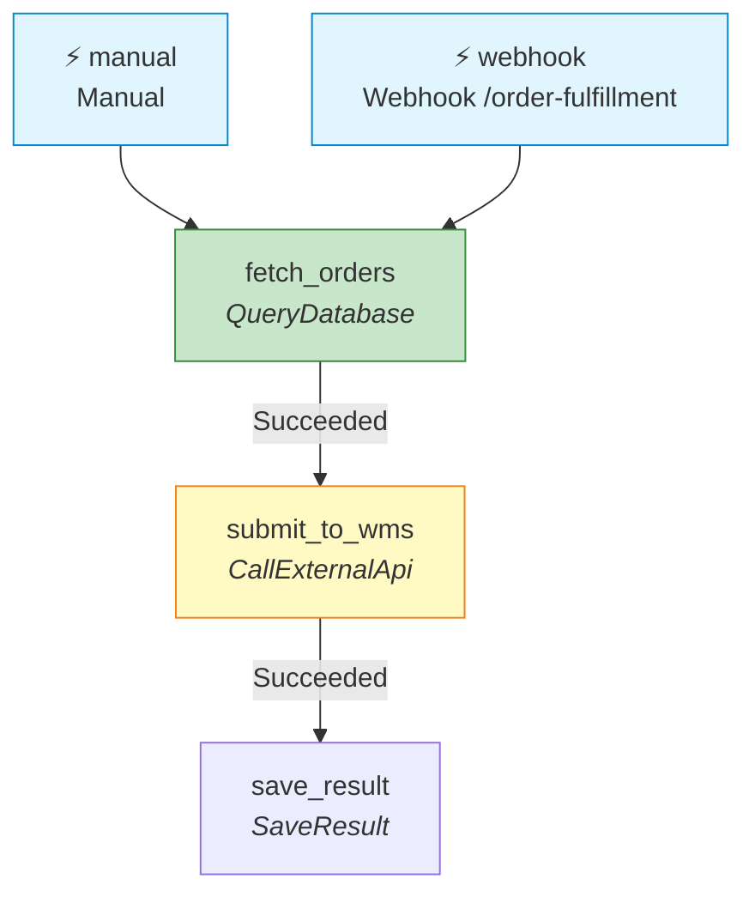

# FlowOrchestrator

**Code-first DAG orchestration for .NET. Runs on Hangfire — or in-process with zero infrastructure.**

[](https://www.nuget.org/packages/FlowOrchestrator.Core)
[](https://www.nuget.org/packages/FlowOrchestrator.Core)
[](LICENSE)
[](https://github.com/hoangsnowy/FlowOrchestrator)

**[📖 Documentation](https://hoangsnowy.github.io/FlowOrchestrator/)** · **[NuGet](https://www.nuget.org/packages/FlowOrchestrator.Core)** · **[GitHub](https://github.com/hoangsnowy/FlowOrchestrator)**

---


---

> **What's new in v1.19** — `AddFlowOrchestratorHealthChecks()` for storage reachability probes, plus two new docs: [Versioning Flows in Production](https://hoangsnowy.github.io/FlowOrchestrator/articles/versioning.html) and [Production Deployment Checklist](https://hoangsnowy.github.io/FlowOrchestrator/articles/production-checklist.html). v1.18 shipped [`WaitForSignal`](https://hoangsnowy.github.io/FlowOrchestrator/articles/wait-for-signal.html) for human-in-loop workflows; v1.17 shipped [`When` conditions](https://hoangsnowy.github.io/FlowOrchestrator/articles/conditional-execution.html) on `RunAfter`. Full [CHANGELOG](CHANGELOG.md).

---

## When to choose FlowOrchestrator

✅ **Choose FlowOrchestrator if:**
- You want multi-step DAGs in .NET without standing up a separate workflow server
- Your team writes C# and wants flows defined as plain code, not JSON or a designer
- You need conditional branching (`When`), polling, fan-out (`ForEach`), human-in-loop (`WaitForSignal`), and cron in one library
- You want a built-in dashboard with Timeline, DAG, and Gantt views
- You want flows that are unit-testable in-process (`FlowTestHost`) and renderable as Mermaid diagrams in a PR
- You already use Hangfire — or you want zero infrastructure at all (in-process runtime works without Hangfire or a database)

❌ **Choose something else if:**
- You need multi-language workflows (Python + Go + .NET) → **[Temporal](https://temporal.io)**
- You want replay-based deterministic execution → **[Temporal](https://temporal.io)**
- You're running a service mesh and want workflow as one of several building blocks → **[Dapr Workflows](https://docs.dapr.io/developing-applications/building-blocks/workflow/)**
- Non-developers need to author workflows in a visual designer → **[Elsa Workflows](https://elsa-workflows.github.io/elsa-core/)**
- You only need fire-and-forget background jobs with no DAG → **Hangfire alone**

> *FlowOrchestrator is intentionally narrow. It is the DAG layer Hangfire is missing — nothing more, nothing less.*

---

## How it compares

| | Hangfire | **FlowOrchestrator** | Elsa v3 | Temporal .NET | Dapr Workflows |
|---|---|---|---|---|---|
| Background job execution | ✓ | ✓ (via Hangfire) | ✓ | ✓ | ✓ |
| Multi-step DAG with `runAfter` | Manual | ✓ | ✓ | Implicit (code) | Implicit (code) |
| Polling pattern (no thread block) | Manual | ✓ built-in | ✓ | ✓ durable timers | ✓ durable timers |
| Code-first C# definitions | ✓ | ✓ | ✓ | ✓ | ✓ |
| JSON / YAML workflow files | ✗ | ✗ by design | ✓ | ✗ | ✗ |
| Visual designer | ✗ | ✗ by design | ✓ Studio | ✗ | ✗ |
| Built-in DAG / Gantt / Timeline UI | ✗ | ✓ | ✓ Studio | ✓ Web UI | ✗ |
| Polyglot SDK | .NET only | .NET only | .NET only | Go, Java, TS, Python, .NET | .NET, Python, JS, Java, Go |
| Separate server / sidecar required | ✗ | ✗ | Optional | ✓ Required | ✓ Sidecar |
| Storage you already have | SQL Server, PG, Redis | SQL Server, PG | SQL Server, PG, MongoDB | Cassandra, MySQL, PG | State store of choice |
| Deterministic replay | ✗ | ✗ | ✗ | ✓ | ✓ |
| External signals / human-in-loop | ✗ | ✓ `WaitForSignal` | ✓ | ✓ | ✓ |
| Operational complexity | Low | Low | Low–Medium | High | Medium |
| Learning curve (.NET dev) | Low | Low | Medium | Medium–High | Medium |

> *FlowOrchestrator deliberately ships fewer features than Temporal or Dapr Workflows. It does not replay. It does not run a separate server. It is for teams that want DAG orchestration inside their existing ASP.NET Core app — alongside Hangfire if they have it, or fully in-process if they do not.*

*Comparison verified 2026-04-30 against Elsa v3, Temporal .NET SDK v1, Dapr .NET SDK v1. [PRs welcome](https://github.com/hoangsnowy/FlowOrchestrator/pulls) to keep it current.*

---

## Coming from Hangfire?

```csharp
// Before — recurring job with manual chaining, no DAG, no run history
RecurringJob.AddOrUpdate<NightlyOrdersJob>("nightly-orders",
    job => job.RunAsync(), "0 2 * * *");
// Inside RunAsync: call FetchOrders, then SubmitToWms, then NotifySlack.
// Error branching, retry-per-step, run history, Gantt view — all on you.

// After — FlowOrchestrator declarative manifest
public sealed class NightlyOrdersFlow : IFlowDefinition
{
    public Guid Id { get; } = new("a1b2c3d4-0000-0000-0000-000000000001");
    public FlowManifest Manifest { get; set; } = new()
    {
        Triggers = { ["cron"] = new() { Type = TriggerType.Cron,
            Inputs = { ["cronExpression"] = "0 2 * * *" } } },
        Steps = {
            ["fetch"]  = new() { Type = "FetchOrders" },
            ["submit"] = new() { Type = "SubmitToWms",
                RunAfter = { ["fetch"]  = [StepStatus.Succeeded] } },
            ["notify"] = new() { Type = "NotifySlack",
                RunAfter = { ["submit"] = [StepStatus.Succeeded] } }
        }
    };
}
// Dashboard, per-step retry, full run history, DAG view — included.
```

And yes — your flows are testable. See [`FlowOrchestrator.Testing`](docs/articles/testing.md) for a one-liner test host that runs flows in-process without Hangfire or ASP.NET.

## Coming from Temporal or Dapr?

If you don't need replay-based determinism and a separate cluster, here is the simpler model:

```csharp
// Temporal .NET — deterministic replay; requires Temporal Server cluster
[Workflow]
public class OrderWorkflow
{
    [WorkflowRun]
    public async Task RunAsync(string orderId)
    {
        await Workflow.ExecuteActivityAsync(
            (Activities a) => a.FetchOrderAsync(orderId),
            new() { ScheduleToCloseTimeout = TimeSpan.FromMinutes(5) });
        await Workflow.ExecuteActivityAsync(
            (Activities a) => a.SubmitToWmsAsync(orderId),
            new() { ScheduleToCloseTimeout = TimeSpan.FromMinutes(5) });
    }
}
// Requires: Temporal Server (Cassandra / MySQL / PG + Elasticsearch + server cluster)

// FlowOrchestrator — same outcome, runs inside your existing ASP.NET Core app
public sealed class OrderFlow : IFlowDefinition
{
    public Guid Id { get; } = new("a1b2c3d4-0000-0000-0000-000000000002");
    public FlowManifest Manifest { get; set; } = new()
    {
        Triggers = { ["manual"] = new() { Type = TriggerType.Manual } },
        Steps = {
            ["fetch"]  = new() { Type = "FetchOrder" },
            ["submit"] = new() { Type = "SubmitToWms",
                RunAfter = { ["fetch"] = [StepStatus.Succeeded] } }
        }
    };
}
// Requires: SQL Server or PostgreSQL you already have, plus Hangfire.
```

---

## Why FlowOrchestrator?

- **Zero new infrastructure** — runs inside your existing Hangfire app on SQL Server or PostgreSQL.
- **Code-first, always** — flows are plain C# classes; no YAML, no JSON files, no designer to learn.
- **Built-in dashboard** — Timeline, DAG, and Gantt views with retry, cancel, and re-run controls.
- **Runtime-agnostic core** — swap Hangfire for in-process channels (or any future adapter) without touching flow definitions.

---

## Pick a runtime

FlowOrchestrator separates **storage** (where flow definitions and run history live) from the **runtime adapter** (which dispatches and executes steps).

| | Hangfire runtime | InMemory runtime |
|---|---|---|
| Step dispatcher | `IBackgroundJobClient` | `Channel<T>` inside the host process |
| Cron triggers | `IRecurringJobManager` (multi-instance safe) | `PeriodicTimer` (single-instance only) |
| Survives process restart | ✓ (jobs in Hangfire storage) | ✗ (in-memory queue) |
| Multi-instance horizontal scale | ✓ | ✗ |
| Extra infrastructure | Hangfire + SQL Server / PostgreSQL | None |
| Best for | Production workloads | Local dev, integration tests, single-node side projects |

Storage is independent — InMemory storage works only for dev / tests, while SQL Server and PostgreSQL are production-ready under either runtime.

---

## Install

```bash
dotnet add package FlowOrchestrator.Core

# Runtime adapter — pick one
dotnet add package FlowOrchestrator.Hangfire     # Hangfire-backed (production default)
dotnet add package FlowOrchestrator.InMemory     # In-process Channel<T> (dev / testing / single-node)

# Storage backend — pick one
dotnet add package FlowOrchestrator.SqlServer    # or FlowOrchestrator.PostgreSQL
                                                  # FlowOrchestrator.InMemory ships its own storage too

# Optional
dotnet add package FlowOrchestrator.Dashboard    # REST API + SPA dashboard
dotnet add package FlowOrchestrator.Testing      # FlowTestHost — in-process integration test helper
```

---

## Quick Start — SQL Server + Hangfire

```csharp
// Program.cs
builder.Services.AddHangfire(c => c
    .SetDataCompatibilityLevel(CompatibilityLevel.Version_170)
    .UseSimpleAssemblyNameTypeSerializer()
    .UseRecommendedSerializerSettings()
    .UseSqlServerStorage(connectionString));
builder.Services.AddHangfireServer();

builder.Services.AddFlowOrchestrator(options =>
{
    options.UseSqlServer(connectionString);       // persist + auto-migrate tables
    options.UseHangfire();                        // Hangfire step dispatcher
    options.AddFlow<OrderFulfillmentFlow>();
});

builder.Services.AddStepHandler<FetchOrdersStep>("FetchOrders");
builder.Services.AddStepHandler<SubmitToWmsStep>("SubmitToWms");
builder.Services.AddFlowDashboard(builder.Configuration); // optional

app.UseHangfireDashboard("/hangfire");
app.MapFlowDashboard("/flows");
```

Define a flow:

```csharp
public sealed class OrderFulfillmentFlow : IFlowDefinition
{
    // Always use a fixed GUID literal — never Guid.NewGuid()
    public Guid Id { get; } = new("a1b2c3d4-0000-0000-0000-000000000002");
    public FlowManifest Manifest { get; set; } = new()
    {
        Triggers = {
            ["manual"]  = new() { Type = TriggerType.Manual },
            ["webhook"] = new() { Type = TriggerType.Webhook,
                Inputs = { ["webhookSlug"] = "order-fulfillment" } }
        },
        Steps = {
            ["fetch"]  = new() { Type = "FetchOrders" },
            ["submit"] = new() { Type = "SubmitToWms",
                RunAfter = { ["fetch"] = [StepStatus.Succeeded] } }
        }
    };
}
```

Open `http://localhost:5000/flows` — trigger the flow, watch steps execute in the DAG view, retry any failure.

## Quick Start — InMemory (zero infrastructure)

For local development, prototypes, and single-node side projects — no Hangfire, no database:

```csharp
// Program.cs
builder.Services.AddFlowOrchestrator(options =>
{
    options.UseInMemory();           // storage in-process
    options.UseInMemoryRuntime();    // Channel<T> dispatcher + PeriodicTimer cron
    options.AddFlow<OrderFulfillmentFlow>();
});

builder.Services.AddStepHandler<FetchOrdersStep>("FetchOrders");
builder.Services.AddStepHandler<SubmitToWmsStep>("SubmitToWms");
builder.Services.AddFlowDashboard(builder.Configuration);

app.MapFlowDashboard("/flows");
```

All run data is lost on restart — see [Storage Backends](https://hoangsnowy.github.io/FlowOrchestrator/articles/storage.html#in-memory) for the full picture, and [Production Checklist](https://hoangsnowy.github.io/FlowOrchestrator/articles/production-checklist.html) for why this combo is unsuitable for production.

For PostgreSQL, see **[📖 Getting Started](https://hoangsnowy.github.io/FlowOrchestrator/articles/getting-started.html)**.

---

## Full documentation

| Topic | Link |
|---|---|
| Getting started (all runtimes) | [getting-started](https://hoangsnowy.github.io/FlowOrchestrator/articles/getting-started.html) |
| Core concepts — Flow, Step, RunId | [core-concepts](https://hoangsnowy.github.io/FlowOrchestrator/articles/core-concepts.html) |
| Step handlers | [step-handlers](https://hoangsnowy.github.io/FlowOrchestrator/articles/step-handlers.html) |
| Trigger types | [triggers](https://hoangsnowy.github.io/FlowOrchestrator/articles/triggers.html) |
| Expression reference (`@triggerBody()`) | [expressions](https://hoangsnowy.github.io/FlowOrchestrator/articles/expressions.html) |
| Polling pattern | [polling](https://hoangsnowy.github.io/FlowOrchestrator/articles/polling.html) |
| ForEach / fan-out | [foreach](https://hoangsnowy.github.io/FlowOrchestrator/articles/foreach.html) |
| Dashboard & REST API | [dashboard](https://hoangsnowy.github.io/FlowOrchestrator/articles/dashboard.html) |
| Storage backends | [storage](https://hoangsnowy.github.io/FlowOrchestrator/articles/storage.html) |
| Configuration reference | [configuration](https://hoangsnowy.github.io/FlowOrchestrator/articles/configuration.html) |
| Architecture | [architecture](https://hoangsnowy.github.io/FlowOrchestrator/articles/architecture.html) |
| Observability | [observability](https://hoangsnowy.github.io/FlowOrchestrator/articles/observability.html) |
| Mermaid export | [mermaid-export](https://hoangsnowy.github.io/FlowOrchestrator/articles/mermaid-export.html) |
| Conditional execution (`When`) | [conditional-execution](https://hoangsnowy.github.io/FlowOrchestrator/articles/conditional-execution.html) |
| Human-in-loop (`WaitForSignal`) | [wait-for-signal](https://hoangsnowy.github.io/FlowOrchestrator/articles/wait-for-signal.html) |
| Testing flows (`FlowTestHost`) | [testing](https://hoangsnowy.github.io/FlowOrchestrator/articles/testing.html) |
| Versioning flows in production | [versioning](https://hoangsnowy.github.io/FlowOrchestrator/articles/versioning.html) |
| Production deployment checklist | [production-checklist](https://hoangsnowy.github.io/FlowOrchestrator/articles/production-checklist.html) |

---

## Production?

Before changing any deployed flow, read **[Versioning Flows](https://hoangsnowy.github.io/FlowOrchestrator/articles/versioning.html)** — it explains which manifest changes are safe and which need a maintenance window. Before go-live, walk through the **[Production Checklist](https://hoangsnowy.github.io/FlowOrchestrator/articles/production-checklist.html)** for storage, multi-instance, monitoring, secrets, capacity, and upgrade guidance. Wire `AddFlowOrchestratorHealthChecks()` into `/health` so your load balancer can drop traffic when the flow store is unreachable.

---

## Visualize any flow with one line

`flow.ToMermaid()` returns a Mermaid flowchart string that renders in GitHub
READMEs, Notion, Confluence, and any modern Markdown surface — no running app
required. Here is the sample `OrderFulfillmentFlow`:



The dashboard ships a Copy Mermaid button on every flow detail page, and the
sample app exposes `--export-mermaid <flowId>` for CI integrations.

---

## Compatibility

| Package | Target frameworks |
|---|---|
| `FlowOrchestrator.Core` | `net8.0` · `net9.0` · `net10.0` |
| `FlowOrchestrator.Hangfire` | `net8.0` · `net9.0` · `net10.0` |
| `FlowOrchestrator.InMemory` | `net8.0` · `net9.0` · `net10.0` |
| `FlowOrchestrator.SqlServer` | `net8.0` · `net9.0` · `net10.0` |
| `FlowOrchestrator.PostgreSQL` | `net8.0` · `net9.0` · `net10.0` |
| `FlowOrchestrator.Dashboard` | `net8.0` · `net9.0` · `net10.0` |
| `FlowOrchestrator.Testing` | `net8.0` · `net9.0` · `net10.0` |

---

[](https://star-history.com/#hoangsnowy/FlowOrchestrator&Date)

---

## License

MIT — see the [LICENSE](LICENSE) file.
