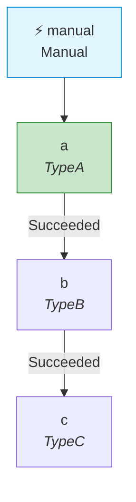
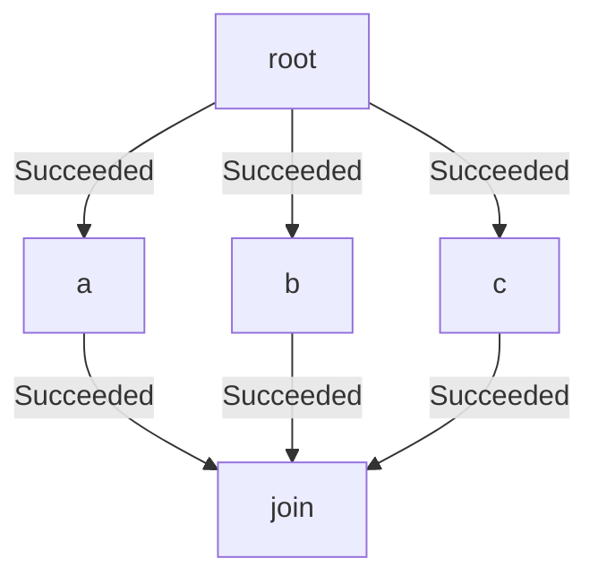
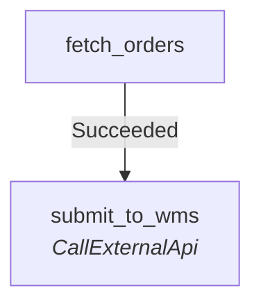
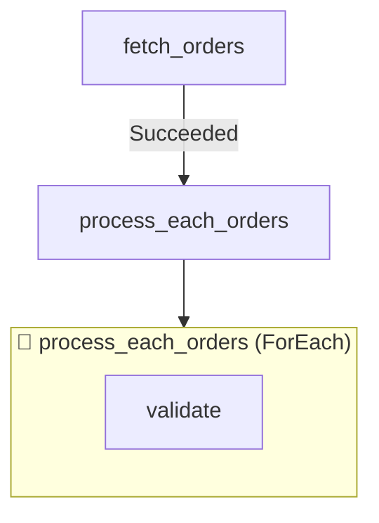

# Mermaid Diagram Export

`FlowOrchestrator.Core` ships with a one-line exporter that converts a flow's
manifest into a [Mermaid](https://mermaid.js.org) `flowchart` definition.
The output is plain text that renders directly in any Markdown surface that
understands Mermaid — GitHub READMEs and PRs, Notion, Obsidian, Confluence,
GitLab, dev.to — without spinning up the dashboard or any other process.

## Quick start

```csharp
using FlowOrchestrator.Core.Diagnostics;

var flow = new OrderFulfillmentFlow();
Console.WriteLine(flow.ToMermaid());
```

The same extension is available on `FlowManifest` directly when you hold the
manifest without a flow definition wrapper.

## Options

`MermaidExportOptions` exposes four knobs:

| Option            | Default | Description                                                                |
|-------------------|---------|----------------------------------------------------------------------------|
| `Direction`       | `TD`    | Mermaid direction header. `TD`, `LR`, `BT`, `RL`.                          |
| `IncludeTriggers` | `true`  | Emits one node per trigger and connects each to the entry steps.           |
| `ShowStepTypes`   | `true`  | Renders the handler `Type` as italic text below each step key.             |
| `ApplyStyling`    | `true`  | Adds `classDef` blocks so triggers, entry, polling, and loop steps differ. |

## Worked examples

### 1. Linear flow

```csharp
new FlowManifest
{
    Triggers = { ["manual"] = new() { Type = TriggerType.Manual } },
    Steps =
    {
        ["a"] = new() { Type = "TypeA" },
        ["b"] = new() { Type = "TypeB", RunAfter = { ["a"] = [StepStatus.Succeeded] } },
        ["c"] = new() { Type = "TypeC", RunAfter = { ["b"] = [StepStatus.Succeeded] } }
    }
}
.ToMermaid();
```



### 2. Fan-out / fan-in

A single root branches into three workers that join at a single leaf.



### 3. Polling step

When a step's `Inputs` carries `pollEnabled = true`, the exporter applies the
`polling` class so it stands out from regular steps.



### 4. ForEach loop

`LoopStepMetadata` becomes a Mermaid `subgraph` containing the child steps.



## Using it from the dashboard

Open any flow's detail page, switch to the **Mermaid** tab, and click
**Copy Mermaid**. The same content is also available via the REST endpoint:

```
GET /flows/api/flows/{id}/mermaid
Accept: text/plain
```

## Using it from CI

The sample app accepts a `--export-mermaid <flowId|flowName>` flag that prints
the diagram and exits without starting the web host. Wire this into a CI job
that comments the new diagram on a pull request whenever a manifest changes:

```bash
dotnet run --project samples/FlowOrchestrator.SampleApp -- \
    --export-mermaid OrderFulfillmentFlow > order-fulfillment.mmd
```
